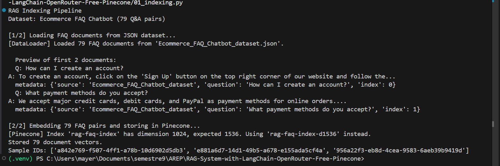
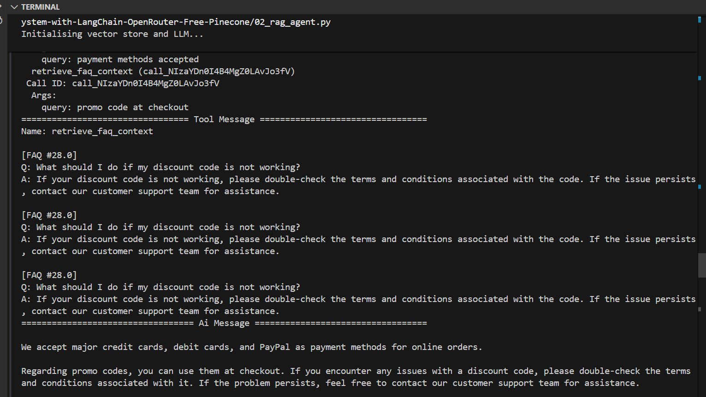
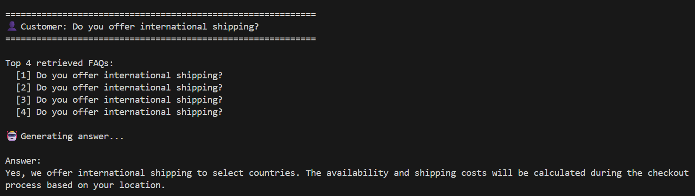
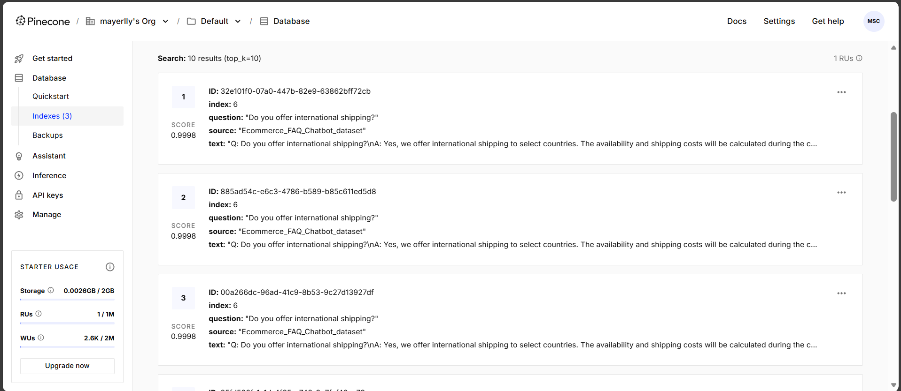
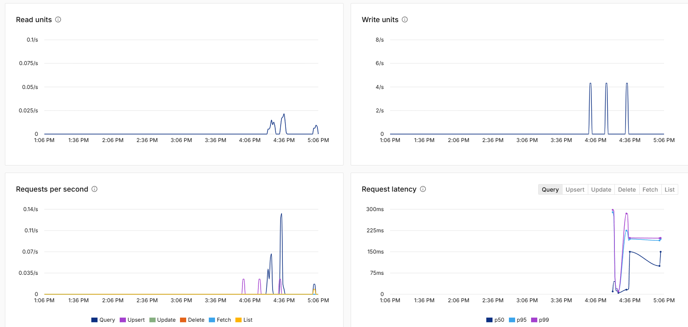
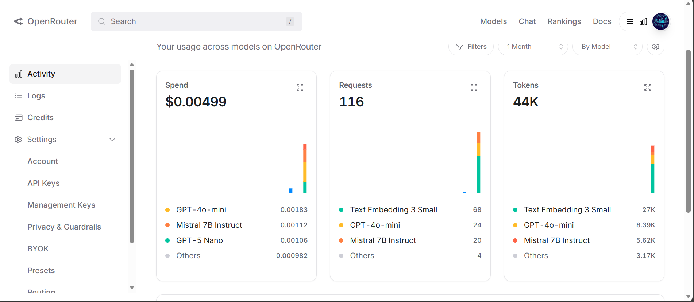

# RAG System with LangChain, OpenRouter (Free) & Pinecone

## RAG Ecommerce FAQ Chatbot

A Retrieval-Augmented Generation (RAG) system that answers ecommerce customer support questions using semantic search over a FAQ dataset. Built with LangChain, OpenRouter (free LLMs), and Pinecone as the vector database. The project includes two RAG approaches: a chain-based pipeline and a ReAct agent with tool use.

## Architecture

```
User Question
      │
      ▼
┌──────────────────────────────────────────────┐
│          RAG Pipeline (2 approaches)         │
│                                              │
│  ┌─────────────────┐  ┌────────────────────┐ │
│  │  03_rag_chain   │  │  02_rag_agent      │ │
│  │  (LangChain     │  │  (ReAct Agent +    │ │
│  │   LCEL Chain)   │  │   Tool Calling)    │ │
│  └────────┬────────┘  └─────────┬──────────┘ │
└───────────┼─────────────────────┼────────────┘
            └──────────┬──────────┘
                       │  similarity_search / retriever
                       ▼
          ┌────────────────────────┐
          │   Pinecone Vector DB   │  ← 79 FAQ vectors stored
          │   (3 Indexes)          │     top-k semantic retrieval
          └────────────┬───────────┘
                       │  retrieved FAQ context
                       ▼
          ┌────────────────────────┐
          │  LLM via OpenRouter    │  ← GPT-4o-mini / Mistral 7B
          │  (Answer Generation)   │     grounded answer from context
          └────────────────────────┘

         ─ ─ ─ ─ ─ ─ ─ ─ ─ ─ ─ ─ ─
          Indexing (run once)

          ┌────────────────────────┐
          │   01_indexing.py       │
          │   Loads JSON dataset   │
          │   → Embeds with        │
          │     text-embedding-    │
          │     3-small            │
          │   → Upserts to         │
          │     Pinecone           │
          └────────────────────────┘
```
## Prerequisites
- Python 3.9+
- A free [Pinecone](https://www.pinecone.io/) account
- A free [OpenRouter](https://openrouter.ai/) account

## Installing & Running

### Step 1 — Clone the repository
```bash
git clone https://github.com/mayerllyyo/RAG-System-with-LangChain-OpenRouter-Free-Pinecone
cd RAG-System-with-LangChain-OpenRouter-Free-Pinecone
```

### Step 2 — Install dependencies
```bash
pip install -r requirements.txt
```

### Step 3 — Configure environment variables
```bash
cp .env.example .env
```

Open `.env` and fill in your keys:
```
OPENROUTER_API_KEY=your_openrouter_api_key_here
PINECONE_API_KEY=your_pinecone_api_key_here
PINECONE_INDEX_NAME=your_pinecone_index_name_here
```

Where to get your keys:
* OpenRouter API Key: [openrouter.ai/keys](https://openrouter.ai/keys) (free tier available)
* Pinecone API Key: [app.pinecone.io](https://app.pinecone.io) → API Keys (starter plan is free)

### Step 4 — Index the FAQ dataset into Pinecone (run once)
```bash
python 01_indexing.py
```

What this does:
1. Loads 79 Q&A pairs from `data/Ecommerce_FAQ_Chatbot_dataset.json`
2. Embeds each document using `text-embedding-3-small` via OpenRouter
3. Upserts all vectors into your Pinecone index

Expected output:



### Step 5a — Run the RAG Agent
A ReAct agent that decides when and how many times to call the `retrieve_faq_context` tool, enabling multi-topic questions in a single query.

```bash
python 02_rag_agent.py
```

Example output (multi-topic question):



### Step 5b — Run the RAG Chain
A simple two-step pipeline: retrieve relevant FAQs → generate answer.

```bash
python 03_rag_chain.py
```

Example output:



## Pinecone — Indexed Records

The vector database stores 79 FAQ embeddings. Each record contains the original question, answer text, and source metadata. Similarity search returns the most relevant documents (score ~0.9998 for semantically close matches).

**Example stored record:**
```json
{
  "id": "7accd22e-8e56-4612-bd14-f1d3d50344cd",
  "metadata": {
    "index": 22,
    "question": "Do you offer expedited shipping?",
    "source": "Ecommerce_FAQ_Chatbot_dataset",
    "text": "Q: Do you offer expedited shipping?\nA: Yes, we offer expedited shipping options for faster delivery. During the checkout process, you can select the desired expedited shipping method."
  }
}
```



### Pinecone — Usage Metrics

Activity spikes correspond to the upsert phase (`01_indexing.py`) and repeated query operations. Query latency stays well under 300ms at p99.



### OpenRouter — API Activity (Last Month)

| Metric | Value |
|---|---|
| Total Spend | $0.00499 |
| Total Requests | 116 |
| Total Tokens | 44K |

| Model | Requests | Tokens | Cost |
|---|---|---|---|
| text-embedding-3-small | 68 | 27K | — |
| GPT-4o-mini | 24 | 8.39K | $0.00183 |
| Mistral 7B Instruct | 20 | 5.62K | $0.00112 |
| GPT-5 Nano | — | 3.17K | $0.00106 |



## Two RAG Approaches Compared

| Feature | `03_rag_chain.py` | `02_rag_agent.py` |
|---|---|---|
| Approach | LCEL Chain | ReAct Agent |
| Tool use | No | Yes (`retrieve_faq_context`) |
| Multi-topic queries | Limited | Can call tool multiple times |
| Transparency | Shows retrieved docs | Shows tool calls & reasoning |
| Best for | Simple, fast Q&A | Complex, multi-part questions |


## Author

- **Mayerlly Suárez Correa** [mayerllyyo](https://github.com/mayerllyyo)

## License

This project is licensed under the MIT License - see the [LICENSE](LICENSE) file for details